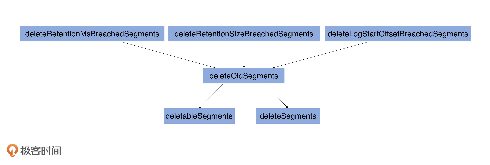
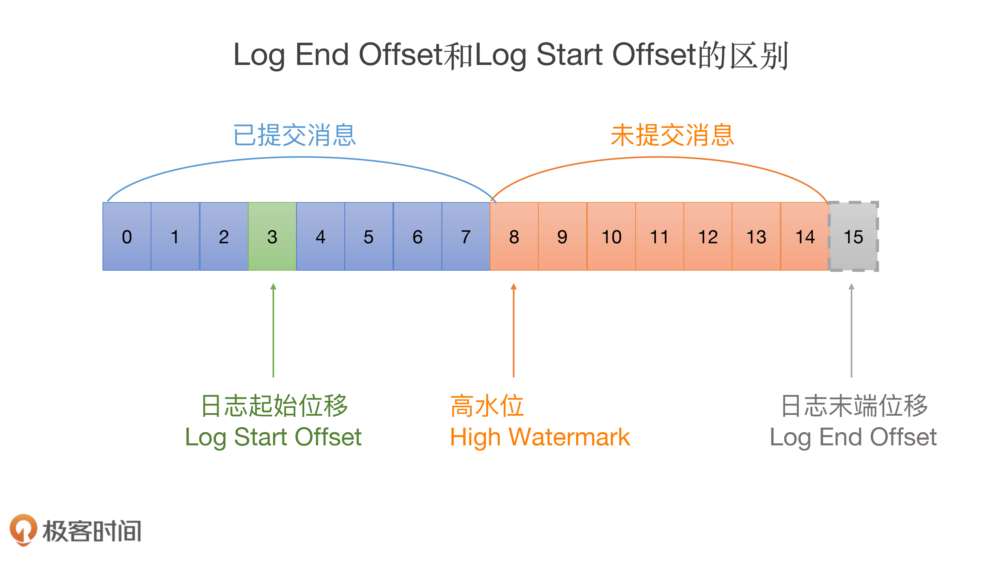
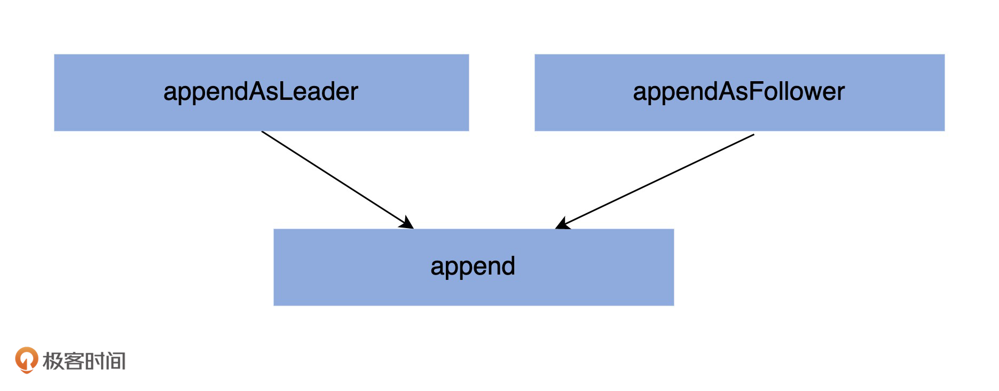

# Log


## 1. 高水位管理
```scala
  /* Keep track of the current high watermark in order to ensure that segments containing offsets at or above it are
   * not eligible for deletion. This means that the active segment is only eligible for deletion if the high watermark
   * equals the log end offset (which may never happen for a partition under consistent load). This is needed to
   * prevent the log start offset (which is exposed in fetch responses) from getting ahead of the high watermark.
   */
  @volatile private var highWatermarkMetadata: LogOffsetMetadata = LogOffsetMetadata(logStartOffset)
```

### 获取和设置 HW


### 更新 HW

```scala

  /**
   * Update the high watermark to a new offset. The new high watermark will be lower
   * bounded by the log start offset and upper bounded by the log end offset.
   *
   * This is intended to be called when initializing the high watermark or when updating
   * it on a follower after receiving a Fetch response from the leader.
   *
   * @param hw the suggested new value for the high watermark
   * @return the updated high watermark offset
   */
  def updateHighWatermark(hw: Long): Long = {
    updateHighWatermark(LogOffsetMetadata(hw))
  }

  /**
   * Update high watermark with offset metadata. The new high watermark will be lower
   * bounded by the log start offset and upper bounded by the log end offset.
   *
   * @param highWatermarkMetadata the suggested high watermark with offset metadata
   * @return the updated high watermark offset
   */
  def updateHighWatermark(highWatermarkMetadata: LogOffsetMetadata): Long = {
    val endOffsetMetadata = logEndOffsetMetadata
    val newHighWatermarkMetadata = if (highWatermarkMetadata.messageOffset < logStartOffset) {
      LogOffsetMetadata(logStartOffset)
    } else if (highWatermarkMetadata.messageOffset >= endOffsetMetadata.messageOffset) {
      endOffsetMetadata
    } else {
      highWatermarkMetadata
    }

    updateHighWatermarkMetadata(newHighWatermarkMetadata)
    newHighWatermarkMetadata.messageOffset
  }

  /**
   * Update the high watermark to a new value if and only if it is larger than the old value. It is
   * an error to update to a value which is larger than the log end offset.
   *
   * This method is intended to be used by the leader to update the high watermark after follower
   * fetch offsets have been updated.
   *
   * @return the old high watermark, if updated by the new value
   */
  def maybeIncrementHighWatermark(newHighWatermark: LogOffsetMetadata): Option[LogOffsetMetadata] = {
    if (newHighWatermark.messageOffset > logEndOffset)
      throw new IllegalArgumentException(s"High watermark $newHighWatermark update exceeds current " +
        s"log end offset $logEndOffsetMetadata")

    lock.synchronized {
      val oldHighWatermark = fetchHighWatermarkMetadata

      // Ensure that the high watermark increases monotonically. We also update the high watermark when the new
      // offset metadata is on a newer segment, which occurs whenever the log is rolled to a new segment.
      if (oldHighWatermark.messageOffset < newHighWatermark.messageOffset ||
        (oldHighWatermark.messageOffset == newHighWatermark.messageOffset && oldHighWatermark.onOlderSegment(newHighWatermark))) {
        updateHighWatermarkMetadata(newHighWatermark)
        Some(oldHighWatermark)
      } else {
        None
      }
    }
  }

```

这两个方法有着不同的用途.
- `updateHighWatermark`:主要用在 Follower副本 从 Leader副本获取到消息后更新高水位值.一旦拿到新的消息,就必须要更新高水位值;
- `maybeIncrementHighWatermark`: 主要是用来更新 Leader 副本的高水位值.需要注意的是,Leader 副本高水位值的更新是有条件的——某些情况下会更新高水位值,某些情况下可能不会.


### 读取 HW

```scala

  private def fetchLastStableOffsetMetadata: LogOffsetMetadata = {
    checkIfMemoryMappedBufferClosed() // 读取时确保日志不被关闭.

    // cache the current high watermark to avoid a concurrent update invalidating the range check
    val highWatermarkMetadata = fetchHighWatermarkMetadata //保存HW 到本地变量, 避免多线程竞争

    firstUnstableOffsetMetadata match {
      case Some(offsetMetadata) if offsetMetadata.messageOffset < highWatermarkMetadata.messageOffset =>
        if (offsetMetadata.messageOffsetOnly) { // 没有获取到完整的高水位元数据
          lock synchronized {
            val fullOffset = convertToOffsetMetadataOrThrow(offsetMetadata.messageOffset)
            if (firstUnstableOffsetMetadata.contains(offsetMetadata))
              firstUnstableOffsetMetadata = Some(fullOffset) // 更新高水位对象.
            fullOffset
          }
        } else {
          offsetMetadata
        }
      case _ => highWatermarkMetadata
    }
  }
```


## 2. LogSegment管理

```scala
  /* the actual segments of the log */
  private val segments: ConcurrentNavigableMap[java.lang.Long, LogSegment] = new ConcurrentSkipListMap[java.lang.Long, LogSegment]

```

- segments 的数据结构是 ConcurrentSkipListMap, 他是线程安全的, key的组织方式是有序的跳表. 可以高效的根据offset定位 segment 对象.

### 增加

```scala
  /**
   * Add the given segment to the segments in this log. If this segment replaces an existing segment, delete it.
   * @param segment The segment to add
   */
  @threadsafe
  private[log] def addSegment(segment: LogSegment): LogSegment = this.segments.put(segment.baseOffset, segment)

```

### 删除操作



kafka 内部提供了多种留存策略(根据一定的规则删除segment), 包括基于时间维度, 基于空间维度,基于LogStartOffset 维度的.


#### 三种留存策略:

##### deleteRetentionMsBreachedSegments

```scala
private def deleteRetentionMsBreachedSegments(): Int = {
  if (config.retentionMs < 0) return 0
  val startMs = time.milliseconds

  def shouldDelete(segment: LogSegment, nextSegmentOpt: Option[LogSegment]): Boolean = {
    startMs - segment.largestTimestamp > config.retentionMs
  }

  deleteOldSegments(shouldDelete, RetentionMsBreach)
}
```

##### deleteRetentionSizeBreachedSegments

```scala
private def deleteRetentionSizeBreachedSegments(): Int = {
  if (config.retentionSize < 0 || size < config.retentionSize) return 0
  var diff = size - config.retentionSize
  def shouldDelete(segment: LogSegment, nextSegmentOpt: Option[LogSegment]): Boolean = {
    if (diff - segment.size >= 0) {
      diff -= segment.size
      true
    } else {
      false
    }
  }

  deleteOldSegments(shouldDelete, RetentionSizeBreach)
}
```


##### deleteLogStartOffsetBreachedSegments

```scala
private def deleteLogStartOffsetBreachedSegments(): Int = {
  def shouldDelete(segment: LogSegment, nextSegmentOpt: Option[LogSegment]): Boolean = {
    nextSegmentOpt.exists(_.baseOffset <= logStartOffset)
  }

  deleteOldSegments(shouldDelete, StartOffsetBreach)
}
```

#### 删除操作操作的入口方法:
```scala
  /**
   * Delete any log segments matching the given predicate function,
   * starting with the oldest segment and moving forward until a segment doesn't match.
   *
   * @param predicate A function that takes in a candidate log segment and the next higher segment
   *                  (if there is one) and returns true iff it is deletable
   * @return The number of segments deleted
   */
private def deleteOldSegments(predicate: (LogSegment, Option[LogSegment]) => Boolean,
                              reason: SegmentDeletionReason): Int = {
  lock synchronized {
    // 筛选出可以删除的日志段对象.
    val deletable = deletableSegments(predicate)
    if (deletable.nonEmpty) {
      // 真正执行删除操作
      deleteSegments(deletable, reason)
    } else
      0
  }
}
```


#### 真正执行删除操作

```scala

private def deleteSegments(deletable: Iterable[LogSegment], reason: SegmentDeletionReason): Int = {
  maybeHandleIOException(s"Error while deleting segments for $topicPartition in dir ${dir.getParent}") {
    val numToDelete = deletable.size
    if (numToDelete > 0) {
      // 不允许删除所有的日志段对象, 如果非要删除, 先创建一个新的.
      // we must always have at least one segment, so if we are going to delete all the segments, create a new one first
      if (segments.size == numToDelete)
        roll()
      lock synchronized {
        checkIfMemoryMappedBufferClosed()
        // remove the segments for lookups
        removeAndDeleteSegments(deletable, asyncDelete = true, reason)
        // 尝试更新 Log 对象的 Log start offset 值
        maybeIncrementLogStartOffset(segments.firstEntry.getValue.baseOffset, SegmentDeletion)
      }
    }
    numToDelete
  }
}
```


## 3. 查询操作


查询日志段对象:
1. segments.firstEntry 获取第一个日志段对象
2. segments.lastEntry 获取最后一个日志段对象(Active LogSegment)
3. segments.higherEntry 获取第一个起始位移值 >= 给定key 的日志段对象
4. segments.floorEntry 获取第一个起始位移值 <= 给定key 的日志段对象


## 4. 关键位移管理



```scala
  @volatile private var nextOffsetMetadata: LogOffsetMetadata = _
```

`Log.nextOffsetMetadata` 就是我们的 LEO 值,  LEO 值永远指向下一条待写入消息.(**LEO 上是没有消息的**)

### LEO 的初始化

```scala
  locally {
    // create the log directory if it doesn't exist
    Files.createDirectories(dir.toPath)

    
    initializeLeaderEpochCache()
    initializePartitionMetadata()

    val nextOffset = loadSegments()

    /* Calculate the offset of the next message */
    nextOffsetMetadata = LogOffsetMetadata(nextOffset, activeSegment.baseOffset, activeSegment.size)

    leaderEpochCache.foreach(_.truncateFromEnd(nextOffsetMetadata.messageOffset))

    updateLogStartOffset(math.max(logStartOffset, segments.firstEntry.getValue.baseOffset))

    // The earliest leader epoch may not be flushed during a hard failure. Recover it here.
    leaderEpochCache.foreach(_.truncateFromStart(logStartOffset))

    // Any segment loading or recovery code must not use producerStateManager, so that we can build the full state here
    // from scratch.
    if (!producerStateManager.isEmpty)
      throw new IllegalStateException("Producer state must be empty during log initialization")

    // Reload all snapshots into the ProducerStateManager cache, the intermediate ProducerStateManager used
    // during log recovery may have deleted some files without the Log.producerStateManager instance witnessing the
    // deletion.
    producerStateManager.removeStraySnapshots(segments.values().asScala.map(_.baseOffset).toSeq)
    loadProducerState(logEndOffset, reloadFromCleanShutdown = hadCleanShutdown)

    // Delete partition metadata file if the version does not support topic IDs.
    // Recover topic ID if present and topic IDs are supported
    if (partitionMetadataFile.exists()) {
        if (!keepPartitionMetadataFile)
          partitionMetadataFile.delete()
        else
          topicId = partitionMetadataFile.read().topicId
    }
  }
```


### LEO 的更新

```scala

  private def updateLogEndOffset(offset: Long): Unit = {
    nextOffsetMetadata = LogOffsetMetadata(offset, activeSegment.baseOffset, activeSegment.size)

    // Update the high watermark in case it has gotten ahead of the log end offset following a truncation
    // or if a new segment has been rolled and the offset metadata needs to be updated.
    if (highWatermark >= offset) {
      updateHighWatermarkMetadata(nextOffsetMetadata)
    }

    if (this.recoveryPoint > offset) {
      this.recoveryPoint = offset
    }
  }
```

### Log 对象在什么场景下会更新  leo ?
- Log 对象初始化
- 写入新消息时.
- Log 对象发生日志切分时(Log Roll)
- 日志截断时.

### Log 对象什么时候会更新 Log Start offset ?
- 日志对象初始化时
- 日志截断时.
- Follower 副本同步时
- 删除日志段时
- 删除消息时


## 5. 读写操作

### 写操作



```scala

  /**
   * Append this message set to the active segment of the log, rolling over to a fresh segment if necessary.
   *
   * This method will generally be responsible for assigning offsets to the messages,
   * however if the assignOffsets=false flag is passed we will only check that the existing offsets are valid.
   *
   * @param records The log records to append
   * @param origin Declares the origin of the append which affects required validations
   * @param interBrokerProtocolVersion Inter-broker message protocol version
   * @param validateAndAssignOffsets Should the log assign offsets to this message set or blindly apply what it is given
   * @param leaderEpoch The partition's leader epoch which will be applied to messages when offsets are assigned on the leader
   * @param ignoreRecordSize true to skip validation of record size.
   * @throws KafkaStorageException If the append fails due to an I/O error.
   * @throws OffsetsOutOfOrderException If out of order offsets found in 'records'
   * @throws UnexpectedAppendOffsetException If the first or last offset in append is less than next offset
   * @return Information about the appended messages including the first and last offset.
   */
  private def append(records: MemoryRecords,
                     origin: AppendOrigin,
                     interBrokerProtocolVersion: ApiVersion,
                     validateAndAssignOffsets: Boolean,
                     leaderEpoch: Int,
                     ignoreRecordSize: Boolean): LogAppendInfo = {

    // 1. 分析和验证待写入消息集合, 并返回校验结果.
    val appendInfo = analyzeAndValidateRecords(records, origin, ignoreRecordSize, leaderEpoch)

    // 2. fast return  如果不需要写入消息
    // return if we have no valid messages or if this is a duplicate of the last appended entry
    if (appendInfo.shallowCount == 0) appendInfo
    else {

      // 2. 验证消息是否规整, 删除无效格式消息或者字节.
      // trim any invalid bytes or partial messages before appending it to the on-disk log
      var validRecords = trimInvalidBytes(records, appendInfo)

      // they are valid, insert them in the log
      lock synchronized {
        maybeHandleIOException(s"Error while appending records to $topicPartition in dir ${dir.getParent}") {
          // 确保 Log 对象未关闭
          checkIfMemoryMappedBufferClosed()
          if (validateAndAssignOffsets) {
            // 3. 使用当前LEO 值作为待写入消息集合中第一条消息的位移值.
            // assign offsets to the message set
            val offset = new LongRef(nextOffsetMetadata.messageOffset)
            appendInfo.firstOffset = Some(LogOffsetMetadata(offset.value))
            val now = time.milliseconds
            val validateAndOffsetAssignResult = try {
              LogValidator.validateMessagesAndAssignOffsets(validRecords,
                topicPartition,
                offset,
                time,
                now,
                appendInfo.sourceCodec,
                appendInfo.targetCodec,
                config.compact,
                config.messageFormatVersion.recordVersion.value,
                config.messageTimestampType,
                config.messageTimestampDifferenceMaxMs,
                leaderEpoch,
                origin,
                interBrokerProtocolVersion,
                brokerTopicStats)
            } catch {
              case e: IOException =>
                throw new KafkaException(s"Error validating messages while appending to log $name", e)
            }
            // 更新校验结果对象,  LogAppendInfo
            validRecords = validateAndOffsetAssignResult.validatedRecords
            appendInfo.maxTimestamp = validateAndOffsetAssignResult.maxTimestamp
            appendInfo.offsetOfMaxTimestamp = validateAndOffsetAssignResult.shallowOffsetOfMaxTimestamp
            appendInfo.lastOffset = offset.value - 1
            appendInfo.recordConversionStats = validateAndOffsetAssignResult.recordConversionStats
            if (config.messageTimestampType == TimestampType.LOG_APPEND_TIME)
              appendInfo.logAppendTime = now

            // 4. 校验消息, 保证消息大小不超限
            // re-validate message sizes if there's a possibility that they have changed (due to re-compression or message
            // format conversion)
            if (!ignoreRecordSize && validateAndOffsetAssignResult.messageSizeMaybeChanged) {
              validRecords.batches.forEach { batch =>
                if (batch.sizeInBytes > config.maxMessageSize) {
                  // we record the original message set size instead of the trimmed size
                  // to be consistent with pre-compression bytesRejectedRate recording
                  brokerTopicStats.topicStats(topicPartition.topic).bytesRejectedRate.mark(records.sizeInBytes)
                  brokerTopicStats.allTopicsStats.bytesRejectedRate.mark(records.sizeInBytes)
                  throw new RecordTooLargeException(s"Message batch size is ${batch.sizeInBytes} bytes in append to" +
                    s"partition $topicPartition which exceeds the maximum configured size of ${config.maxMessageSize}.")
                }
              }
            }
          } else {
            // 使用给定的消息位移值, 无需自己分配位移值.
            // we are taking the offsets we are given
            if (!appendInfo.offsetsMonotonic) // 确保消息位移值的单调递增性.
              throw new OffsetsOutOfOrderException(s"Out of order offsets found in append to $topicPartition: " +
                records.records.asScala.map(_.offset))

            if (appendInfo.firstOrLastOffsetOfFirstBatch < nextOffsetMetadata.messageOffset) {
              // we may still be able to recover if the log is empty
              // one example: fetching from log start offset on the leader which is not batch aligned,
              // which may happen as a result of AdminClient#deleteRecords()
              val firstOffset = appendInfo.firstOffset match {
                case Some(offsetMetadata) => offsetMetadata.messageOffset
                case None => records.batches.asScala.head.baseOffset()
              }

              val firstOrLast = if (appendInfo.firstOffset.isDefined) "First offset" else "Last offset of the first batch"
              throw new UnexpectedAppendOffsetException(
                s"Unexpected offset in append to $topicPartition. $firstOrLast " +
                  s"${appendInfo.firstOrLastOffsetOfFirstBatch} is less than the next offset ${nextOffsetMetadata.messageOffset}. " +
                  s"First 10 offsets in append: ${records.records.asScala.take(10).map(_.offset)}, last offset in" +
                  s" append: ${appendInfo.lastOffset}. Log start offset = $logStartOffset",
                firstOffset, appendInfo.lastOffset)
            }
          }

          // 5. 更新Leader Epoch 缓存.
          // update the epoch cache with the epoch stamped onto the message by the leader
          validRecords.batches.forEach { batch =>
            if (batch.magic >= RecordBatch.MAGIC_VALUE_V2) {
              maybeAssignEpochStartOffset(batch.partitionLeaderEpoch, batch.baseOffset)
            } else {
              // In partial upgrade scenarios, we may get a temporary regression to the message format. In
              // order to ensure the safety of leader election, we clear the epoch cache so that we revert
              // to truncation by high watermark after the next leader election.
              leaderEpochCache.filter(_.nonEmpty).foreach { cache =>
                warn(s"Clearing leader epoch cache after unexpected append with message format v${batch.magic}")
                cache.clearAndFlush()
              }
            }
          }

          // 6. 确保消息大小不超限
          // check messages set size may be exceed config.segmentSize
          if (validRecords.sizeInBytes > config.segmentSize) {
            throw new RecordBatchTooLargeException(s"Message batch size is ${validRecords.sizeInBytes} bytes in append " +
              s"to partition $topicPartition, which exceeds the maximum configured segment size of ${config.segmentSize}.")
          }

          // 7. 执行日志切分， 当前日志段剩余容量可能无法容纳新消息集合, 因此有必要创建一个新的 segment.
          // maybe roll the log if this segment is full
          val segment = maybeRoll(validRecords.sizeInBytes, appendInfo)

          val logOffsetMetadata = LogOffsetMetadata(
            messageOffset = appendInfo.firstOrLastOffsetOfFirstBatch,
            segmentBaseOffset = segment.baseOffset,
            relativePositionInSegment = segment.size)

          // 8. 验证事务状态.
          // now that we have valid records, offsets assigned, and timestamps updated, we need to
          // validate the idempotent/transactional state of the producers and collect some metadata
          val (updatedProducers, completedTxns, maybeDuplicate) = analyzeAndValidateProducerState(
            logOffsetMetadata, validRecords, origin)

          maybeDuplicate match {
            case Some(duplicate) =>
              appendInfo.firstOffset = Some(LogOffsetMetadata(duplicate.firstOffset))
              appendInfo.lastOffset = duplicate.lastOffset
              appendInfo.logAppendTime = duplicate.timestamp
              appendInfo.logStartOffset = logStartOffset
            case None =>
              // Before appending update the first offset metadata to include segment information
              appendInfo.firstOffset = appendInfo.firstOffset.map { offsetMetadata =>
                offsetMetadata.copy(segmentBaseOffset = segment.baseOffset, relativePositionInSegment = segment.size)
              }

              // 9.执行真正的消息写入操作, 主要调用的的是 LogSegment.append()..
              segment.append(largestOffset = appendInfo.lastOffset,
                largestTimestamp = appendInfo.maxTimestamp,
                shallowOffsetOfMaxTimestamp = appendInfo.offsetOfMaxTimestamp,
                records = validRecords)

              // 10. 跟新LEO 对象, LEO = 集合中最后一条消息位移 + 1,
              // LEO 永远指向下一条待写入消息.
              // Increment the log end offset. We do this immediately after the append because a
              // write to the transaction index below may fail and we want to ensure that the offsets
              // of future appends still grow monotonically. The resulting transaction index inconsistency
              // will be cleaned up after the log directory is recovered. Note that the end offset of the
              // ProducerStateManager will not be updated and the last stable offset will not advance
              // if the append to the transaction index fails.
              updateLogEndOffset(appendInfo.lastOffset + 1)

              // 11. 更新事务状态.
              // update the producer state
              updatedProducers.values.foreach(producerAppendInfo => producerStateManager.update(producerAppendInfo))

              // update the transaction index with the true last stable offset. The last offset visible
              // to consumers using READ_COMMITTED will be limited by this value and the high watermark.
              completedTxns.foreach { completedTxn =>
                val lastStableOffset = producerStateManager.lastStableOffset(completedTxn)
                segment.updateTxnIndex(completedTxn, lastStableOffset)
                producerStateManager.completeTxn(completedTxn)
              }

              // always update the last producer id map offset so that the snapshot reflects the current offset
              // even if there isn't any idempotent data being written
              producerStateManager.updateMapEndOffset(appendInfo.lastOffset + 1)

              // update the first unstable offset (which is used to compute LSO)
              maybeIncrementFirstUnstableOffset()

              trace(s"Appended message set with last offset: ${appendInfo.lastOffset}, " +
                s"first offset: ${appendInfo.firstOffset}, " +
                s"next offset: ${nextOffsetMetadata.messageOffset}, " +
                s"and messages: $validRecords")

              // 是否需要手动落盘,
              // 落盘操作是由参数 `log.flush.interval.ms`  `log.flush.interval.messages` 决定.
              if (unflushedMessages >= config.flushInterval) flush()
          }
          appendInfo
        }
      }
    }
  }
```

append方法执行流程

