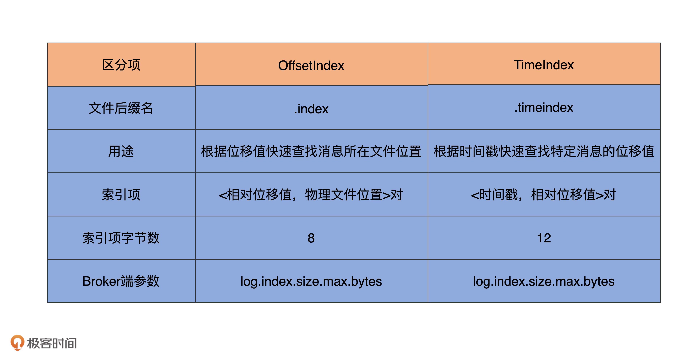

# index


- AbstractIndex: 封装了所有索引类型的公共操作.
- LazyIndex: AbstractIndex 的封装, 实现索引项延时加载, 这个类主要是为了提高性能.
- OffsetIndex: 位移索引, 保存<位移值, 文件磁盘物理位置> 的映射
- TimeIndex: 时间戳索引, 保存<timestamp, 位移值> 的映射
- TransactionIndex: 事务索引. 为已终止事务(Abort Transaction)保存元数据信息. (只有开启了事务才会有这个索引)


## 索引类


## AbstractIndex


### 属性

1. file

每个索引对象在磁盘上都对应了一个索引文件.你可能注意到了,这个字段是 var 型,说明它是可以被修改的.
难道索引对象还能动态更换底层的索引文件吗.是的,自 1.1.0 版本之后,Kafka 允许迁移底层的日志路径,
所以,索引文件自然要是可以更换的.

2. baseOffset

索引对象对应日志段对象的起始位移值.举个例子,如果你查看 Kafka 日志路径的话,就会发现,日志文件和索引文件都是成组出现的.
比如说,如果日志文件是 `00000000000000000123.log`
,正常情况下,一定还有一组索引文件 `00000000000000000123.index`、`00000000000000000123.timeindex`
等.这里的`123`就是这组文件的起始位移值,也就是 `baseOffset` 值.

3. maxIndexSize

它控制索引文件的最大长度. Kafka源码传入该参数的值是 Broker 端参数 `segment.index.bytes` 的值,即 10MB.
这就是在默认情况下,所有 Kafka 索引文件大小都是 10MB 的原因.

4. writable

`True`表示以读写方式打开,`False`表示以只读方式打开.
如果我没记错的话,这个参数应该是我加上去的,就是为了修复我刚刚提到的那个 Bug.


### 行为

1. 写入索引项: OffsetIndex.append()


OffsetIndex.append().
```scala

  def append(offset: Long, position: Int): Unit = {
    inLock(lock) {
      // 判断索引文件未写满.
      require(!isFull, "Attempt to append to a full index (size = " + _entries + ").")
      // 2. 满足一下条件之一才允许写入索引项.
      // - 当前索引文件为空.
      // - 写入的位移 > 当前所有已写入的索引项的位移(kafka规定索引项中的位移值必须是单调递增的)
      if (_entries == 0 || offset > _lastOffset) {
        trace(s"Adding index entry $offset => $position to ${file.getAbsolutePath}")
        mmap.putInt(relativeOffset(offset)) // mmap 写入相对位移值
        mmap.putInt(position) // mmap写入物理位置信息
        // 更新其他元数据统计信息,比如当前索引项计数器&当前索引项位移值.
        _entries += 1
        _lastOffset = offset
        // 执行校验 写入索引项格式必须符合要求.
        require(_entries * entrySize == mmap.position(), s"$entries entries but file position in index is ${mmap.position()}.")
      } else {
        // 如果以上两个条件都不能满足, 不能执行写入索引项操作, 抛出异常.
        throw new InvalidOffsetException(s"Attempt to append an offset ($offset) to position $entries no larger than" +
          s" the last offset appended (${_lastOffset}) to ${file.getAbsolutePath}.")
      }
    }
  }
```


2. 查找索引项


OffsetIndex.parseEntry()
```scala
  override protected def parseEntry(buffer: ByteBuffer, n: Int): OffsetPosition = {
    OffsetPosition(baseOffset + relativeOffset(buffer, n), physical(buffer, n))
  }
```

TimeIndex.parseEntry()
```scala

  override def parseEntry(buffer: ByteBuffer, n: Int): TimestampOffset = {
    TimestampOffset(timestamp(buffer, n), baseOffset + relativeOffset(buffer, n))
  }

```


3. 二分法查找


4. 改进版二分法

大部分操作系统使用页缓存来实现内存映射, 而几乎所有的操作系统都是用LRU 机制来管理页缓存(PageCache).
Kafka写入索引文件的方式是文件末尾追加写入, 而几乎所有的索引查询都集中在索引的尾部. (LRU非常适合kafka索引访问场景.)

但是 原版的二分查找算法并未考虑到缓存的问题, 因此可能会产生一些不必要的页中断(page Fault). 
此时kafka线程会被阻塞, 等待对应的索引项从物理磁盘读出并放入到页缓存.

- [Kafka索引的二分查找算法](https://www.applenice.net/2021/02/15/Kafka-Notes-10/)


## OffsetIndex 与 TimeIndex 的区别

