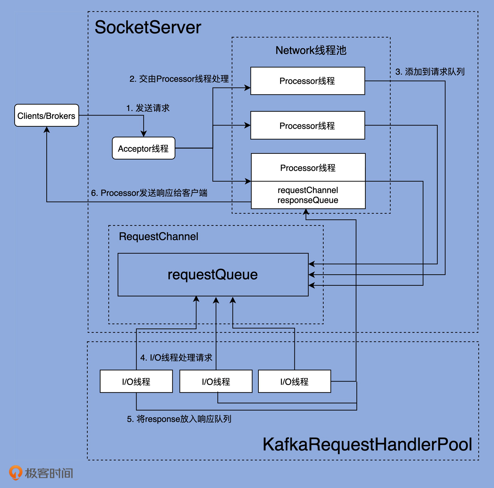
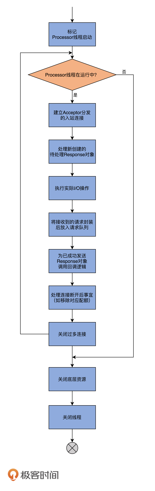

# Kafaka 如何使用 Nio 的



Kafka 主要的网络通信组件主要是  SocketServer & KafkaRequestHandlerPool.

SocketServer 主要实现了 Reactor模式,  用于处理多个并发的client请求, 并负责将结果封装进response, 返回给client。

KafkaRequestHandlerPool 就是IO线程池, 用于真正执行请求处理逻辑。


## accptor

acceptor.run() 方法:
```scala
  /**
   * Accept loop that checks for new connection attempts
   */
  def run(): Unit = {
    // 向 serverSocketChannel 注册 OP_ACCEPT事件
    serverChannel.register(nioSelector, SelectionKey.OP_ACCEPT)
    startupComplete()
    try {
      while (isRunning) {
        try {
          acceptNewConnections()
          closeThrottledConnections()
        }
        catch {
          // We catch all the throwables to prevent the acceptor thread from exiting on exceptions due
          // to a select operation on a specific channel or a bad request. We don't want
          // the broker to stop responding to requests from other clients in these scenarios.
          case e: ControlThrowable => throw e
          case e: Throwable => error("Error occurred", e)
        }
      }
    } finally {
      debug("Closing server socket, selector, and any throttled sockets.")
      CoreUtils.swallow(serverChannel.close(), this, Level.ERROR)
      CoreUtils.swallow(nioSelector.close(), this, Level.ERROR)
      throttledSockets.foreach(throttledSocket => closeSocket(throttledSocket.socket))
      throttledSockets.clear()
      shutdownComplete()
    }
  }
```


## processor 

processor线程的run方法:


```scala
//kafka/network/SocketServer.scala:898
override def run(): Unit = {
  // 等待 processor 线程启动完成.
  startupComplete()
  try {
    while (isRunning) {
      try {
        // 1. 创建新连接
        // setup any new connections that have been queued up
        configureNewConnections()
        // 2.发送Response, 将Response 放入 processor.responseQueue 中.
        // register any new responses for writing
        processNewResponses()
        // 3. 执行 NIO.poll(),  获取SocketChannel 上准备就绪的操作, 真正执行 IO的地方.
        // 接收 request & 发送 response.
        poll()
        // 4. 将接收到的Request放入到 request队列
        processCompletedReceives()
        // 5.为 response队列中的response执行回调逻辑.
        processCompletedSends()
        // 6.处理因为发送失败而导致的链接断开
        processDisconnected()
        // 7.关闭超过配额限制部分的连接
        closeExcessConnections()
      } catch {
        // We catch all the throwables here to prevent the processor thread from exiting. We do this because
        // letting a processor exit might cause a bigger impact on the broker. This behavior might need to be
        // reviewed if we see an exception that needs the entire broker to stop. Usually the exceptions thrown would
        // be either associated with a specific socket channel or a bad request. These exceptions are caught and
        // processed by the individual methods above which close the failing channel and continue processing other
        // channels. So this catch block should only ever see ControlThrowables.
        case e: Throwable => processException("Processor got uncaught exception.", e)
      }
    }
  } finally {
    // 关闭底层资源
    debug(s"Closing selector - processor $id")
    CoreUtils.swallow(closeAll(), this, Level.ERROR)
    shutdownComplete()
  }
}

```

