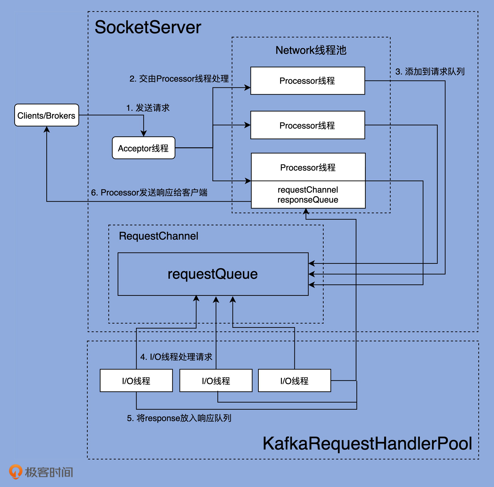
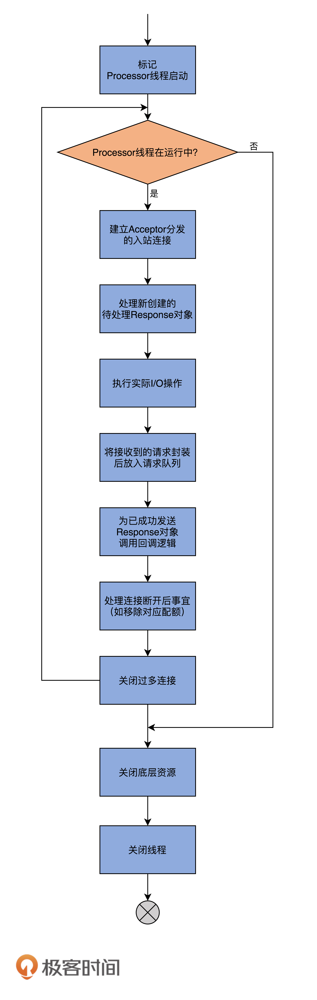

# Kafaka 如何使用 Nio 的



Kafka 主要的网络通信组件主要是  SocketServer & KafkaRequestHandlerPool.

SocketServer 主要实现了 Reactor模式,  用于处理多个并发的client请求, 并负责将结果封装进response, 返回给client。

KafkaRequestHandlerPool 就是IO线程池, 用于真正执行请求处理逻辑。


## accptor


## processor 

processor线程的run方法:
```java

```

