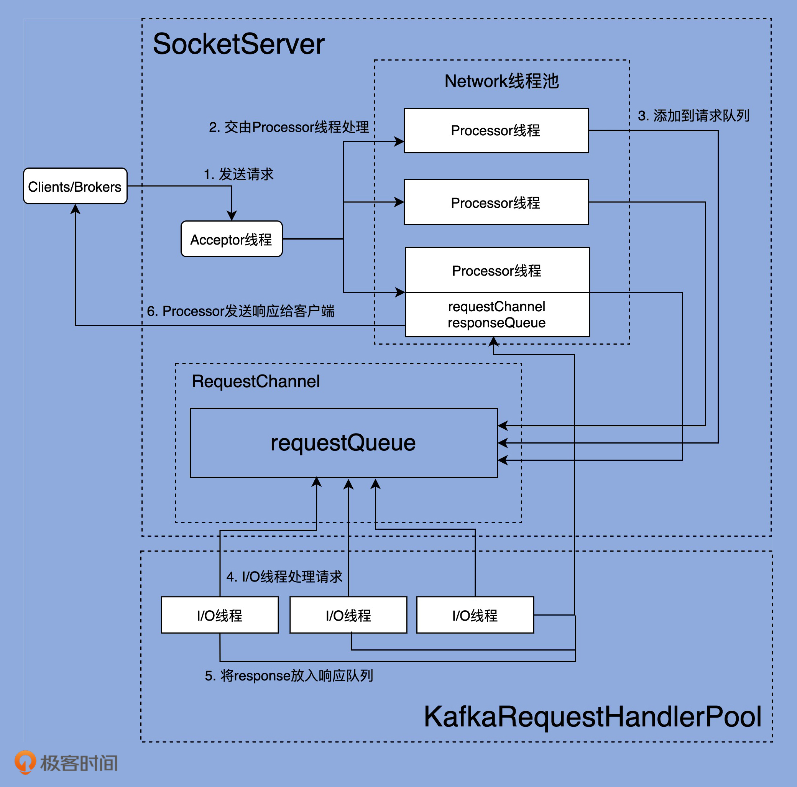

# Kafka 网络模型架构



processor 网络线程  与 acceptor 是在 RequestChannel 中管理的.
```scala

class RequestChannel(val queueSize: Int,
                     val metricNamePrefix: String,
                     time: Time,
                     val metrics: RequestChannel.Metrics) extends KafkaMetricsGroup {

  import RequestChannel._

  private val requestQueue = new ArrayBlockingQueue[BaseRequest](queueSize)
  private val processors = new ConcurrentHashMap[Int, Processor]()
  val requestQueueSizeMetricName = metricNamePrefix.concat(RequestQueueSizeMetric)
  val responseQueueSizeMetricName = metricNamePrefix.concat(ResponseQueueSizeMetric)

  // ...
  def addProcessor(processor: Processor): Unit = {
    if (processors.putIfAbsent(processor.id, processor) != null)
      warn(s"Unexpected processor with processorId ${processor.id}")

    // ...
  }

  def removeProcessor(processorId: Int): Unit = {
    processors.remove(processorId)
    // ...
  }
  // ...

}

```

processor 线程将收到的请求发送到 requestQueue 中, IO线程从request中拉取request , 进行处理.

`sendResponse`: 仅将 response 对象发送到 processor.response 队列.
```scala

  /** Send a request to be handled, potentially blocking until there is room in the queue for the request */
  def sendRequest(request: RequestChannel.Request): Unit = {
    requestQueue.put(request)
  }

  /** Send a response back to the socket server to be sent over the network */
  def sendResponse(response: RequestChannel.Response): Unit = {

    if (isTraceEnabled) {
      val requestHeader = response.request.headerForLoggingOrThrottling()
      val message = response match {
        case sendResponse: SendResponse =>
          s"Sending ${requestHeader.apiKey} response to client ${requestHeader.clientId} of ${sendResponse.responseSend.size} bytes."
        case _: NoOpResponse =>
          s"Not sending ${requestHeader.apiKey} response to client ${requestHeader.clientId} as it's not required."
        case _: CloseConnectionResponse =>
          s"Closing connection for client ${requestHeader.clientId} due to error during ${requestHeader.apiKey}."
        case _: StartThrottlingResponse =>
          s"Notifying channel throttling has started for client ${requestHeader.clientId} for ${requestHeader.apiKey}"
        case _: EndThrottlingResponse =>
          s"Notifying channel throttling has ended for client ${requestHeader.clientId} for ${requestHeader.apiKey}"
      }
      trace(message)
    }

    response match {
      // We should only send one of the following per request
      case _: SendResponse | _: NoOpResponse | _: CloseConnectionResponse =>
        val request = response.request
        val timeNanos = time.nanoseconds()
        request.responseCompleteTimeNanos = timeNanos
        if (request.apiLocalCompleteTimeNanos == -1L)
          request.apiLocalCompleteTimeNanos = timeNanos
      // For a given request, these may happen in addition to one in the previous section, skip updating the metrics
      case _: StartThrottlingResponse | _: EndThrottlingResponse => ()
    }

    val processor = processors.get(response.processor)
    // The processor may be null if it was shutdown. In this case, the connections
    // are closed, so the response is dropped.
    if (processor != null) {
      processor.enqueueResponse(response)
    }
  }
```


