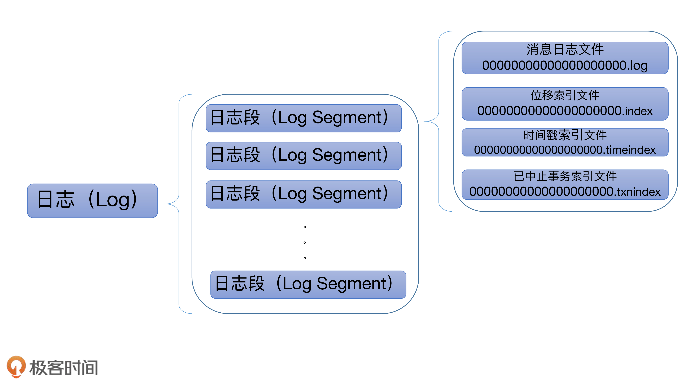
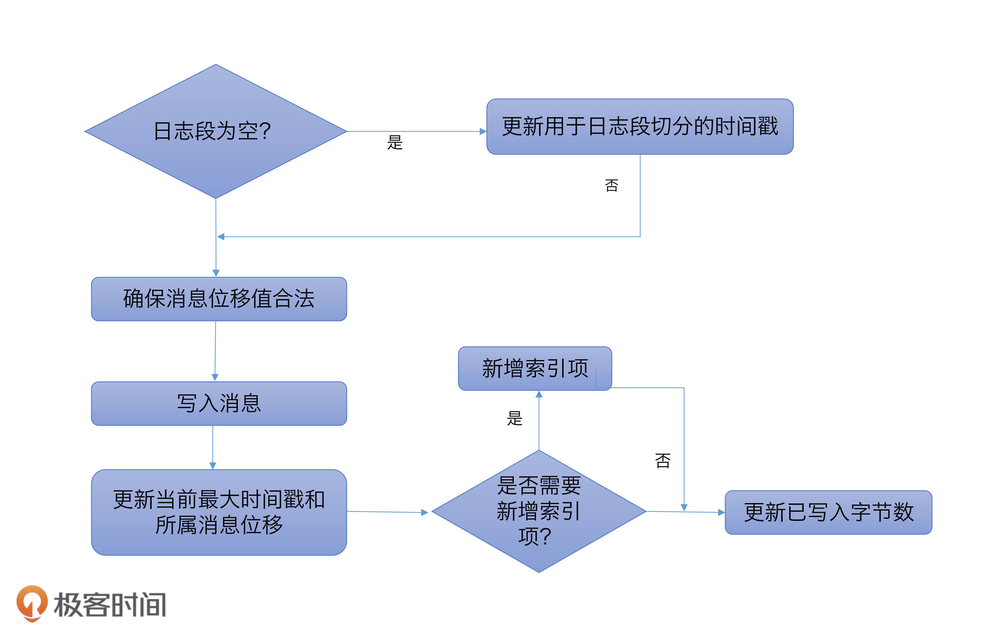
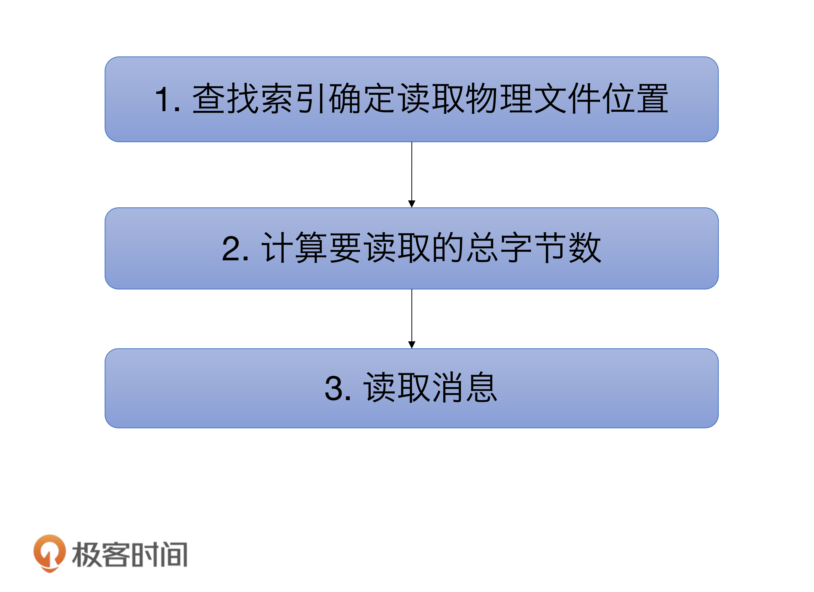
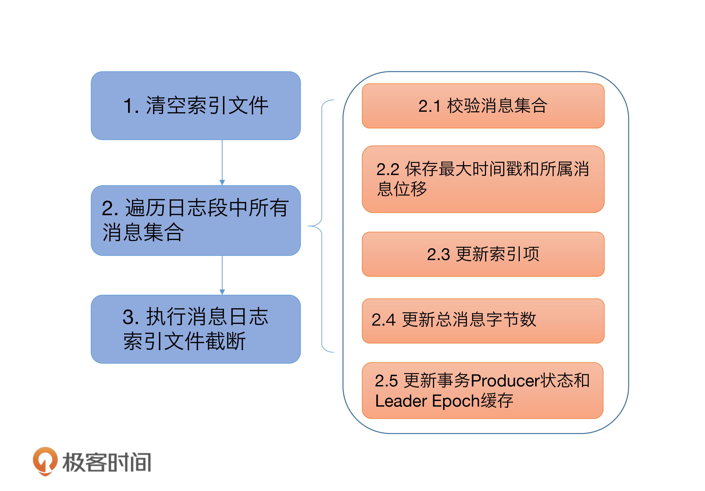
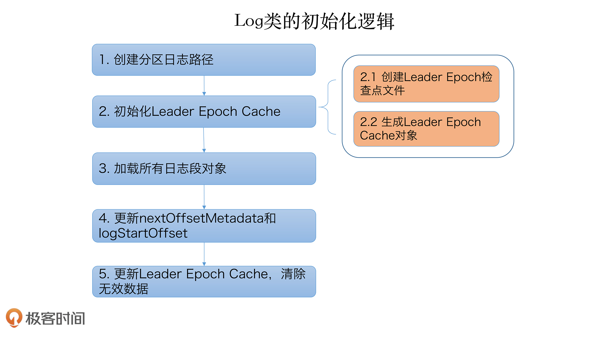

# Log LogSegment

kafka 日志结构:


Kafka 日志对象是由多个日志段对象组成,
每个日志段对象会在磁盘上创建 `日志文件(.log)`, `位移索引文件(.index)`， `时间戳索引文件(.timeindex)`, `事务索引文件(.txnindex)`.

一般情况下,一个 Kafka 主题有很多分区,每个分区就对应一个 Log 对象,在物理磁盘上则对应于一个子目录.
如果创建了一个双分区的主题 test-topic,那么，Kafka 在磁盘上会创建两个子目录: `test-topic-0`, `test-topic-1`
而在服务器端,这就是两个 Log 对象.每个子目录下存在多组日志段,也就是多组.log、.index、.timeindex
文件组合,只不过文件名不同,因为每个日志段的起始位移不同.

```scala
/**
 * A segment of the log. Each segment has two components: a log and an index. The log is a FileRecords containing
 * the actual messages. The index is an OffsetIndex that maps from logical offsets to physical file positions. Each
 * segment has a base offset which is an offset <= the least offset of any message in this segment and > any offset in
 * any previous segment.
 *
 * A segment with a base offset of [base_offset] would be stored in two files, a [base_offset].index and a [base_offset].log file.
 *
 * @param log                The file records containing log entries
 * @param lazyOffsetIndex    The offset index
 * @param lazyTimeIndex      The timestamp index
 * @param txnIndex           The transaction index
 * @param baseOffset         A lower bound on the offsets in this segment
 * @param indexIntervalBytes The approximate number of bytes between entries in the index
 * @param rollJitterMs       The maximum random jitter subtracted from the scheduled segment roll time
 * @param time               The time instance
 */
@nonthreadsafe
class LogSegment private[log](val log: FileRecords,
                              val lazyOffsetIndex: LazyIndex[OffsetIndex], //  对应索引文件
                              val lazyTimeIndex: LazyIndex[TimeIndex], //  对应索引文件
                              val txnIndex: TransactionIndex, // 对应索引文件
                              val baseOffset: Long,
                              val indexIntervalBytes: Int, // log.index.interval.bytes
                              val rollJitterMs: Long, // 日志段新增倒计时的扰动值
                              val time: Time) extends Logging {
...
}
```

indexIntervalBytes: 值其实就是 Broker 端参数 `log.index.interval.bytes` 值,它控制了日志段对象新增索引项的频率.
默认情况下，日志段至少新写入 4KB 的消息数据才会新增一条索引项.
rollJitterMs:  是日志段对象新增倒计时的`扰动值`. 因为目前 Broker 端日志段新增倒计时是全局设置,在未来的某个时刻可能同时创建多个日志段对象,
这将极大地增加物理磁盘 I/O 压力. 有了 `rollJitterMs` 值的干扰，每个新增日志段在创建时会彼此岔开一小段时间,这样可以缓解物理磁盘的
I/O 负载瓶颈.

对于日志段而言， 最重要的方法就是 读取与写入了. `append` and `read`

### append

```scala

```




### read

```scala

```




### recover 

Broker 启动时， 会从磁盘中加载所有的日志段信息到内存中, 并创建对应的 LogSegment 对象实例.
```scala

```





## Log 对象


### Log 对象初始化逻辑



```scala
  locally {
  // create the log directory if it doesn't exist
  Files.createDirectories(dir.toPath)

  initializeLeaderEpochCache()
  initializePartitionMetadata()

  val nextOffset = loadSegments()

  /* Calculate the offset of the next message */
  nextOffsetMetadata = LogOffsetMetadata(nextOffset, activeSegment.baseOffset, activeSegment.size)

  leaderEpochCache.foreach(_.truncateFromEnd(nextOffsetMetadata.messageOffset))

  updateLogStartOffset(math.max(logStartOffset, segments.firstEntry.getValue.baseOffset))

  // The earliest leader epoch may not be flushed during a hard failure. Recover it here.
  leaderEpochCache.foreach(_.truncateFromStart(logStartOffset))

  // Any segment loading or recovery code must not use producerStateManager, so that we can build the full state here
  // from scratch.
  if (!producerStateManager.isEmpty)
    throw new IllegalStateException("Producer state must be empty during log initialization")

  // Reload all snapshots into the ProducerStateManager cache, the intermediate ProducerStateManager used
  // during log recovery may have deleted some files without the Log.producerStateManager instance witnessing the
  // deletion.
  producerStateManager.removeStraySnapshots(segments.values().asScala.map(_.baseOffset).toSeq)
  loadProducerState(logEndOffset, reloadFromCleanShutdown = hadCleanShutdown)

  // Delete partition metadata file if the version does not support topic IDs.
  // Recover topic ID if present and topic IDs are supported
  if (partitionMetadataFile.exists()) {
    if (!keepPartitionMetadataFile)
      partitionMetadataFile.delete()
    else
      topicId = partitionMetadataFile.read().topicId
  }
}
```


-----------

- [kafka文件存储](https://tech.meituan.com/2015/01/13/kafka-fs-design-theory.html)