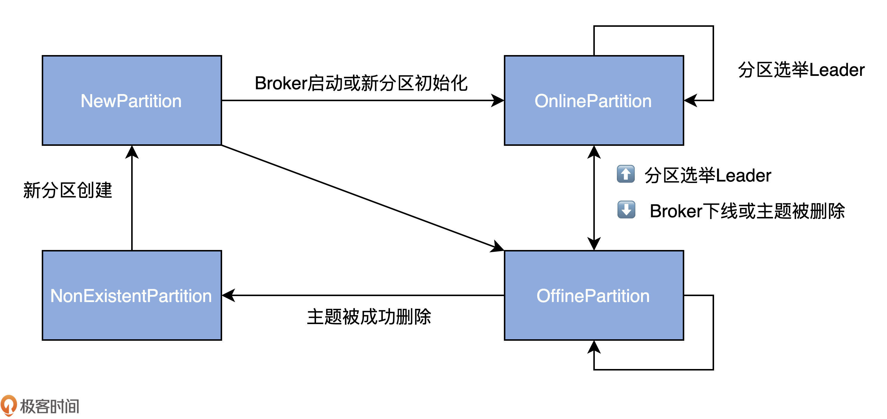

# 分区状态机

每个Broker 启动时都会创建`ReplicaStateMachine` 和 `PartitionStateMachine`, 但只有 Controller所在的 broker才会启动他们,
如果
Controller变更到其他Broker, 老Controller 所在的Broker 会调用状态机的`shutdown()`, 新 Controller 所在的 Broker
会调用状态机的 `startup()`

## 分区状态

- NewPartition:
- OnlinePartition:
- OfflinePartition:
- NonExistentPartition:



## 分区副本选举

```scala
// 分区leader 选举策略接口
sealed trait PartitionLeaderElectionStrategy
// 离线分区leader选举策略
final case class OfflinePartitionLeaderElectionStrategy(allowUnclean: Boolean) extends PartitionLeaderElectionStrategy
// 分区副本重分配 选举策略
final case object ReassignPartitionLeaderElectionStrategy extends PartitionLeaderElectionStrategy
// 分区Preferred副本 选举策略
final case object PreferredReplicaPartitionLeaderElectionStrategy extends PartitionLeaderElectionStrategy
// Broker Controllered 关闭时选举策略
final case object ControlledShutdownPartitionLeaderElectionStrategy extends PartitionLeaderElectionStrategy
```

### PartitionLeaderElectionAlgorithms
针对上述四种策略, 分区状态机定义了  PartitionLeaderElectionAlgorithms 定义了四种方法负责上述场景的选举leader副本.


